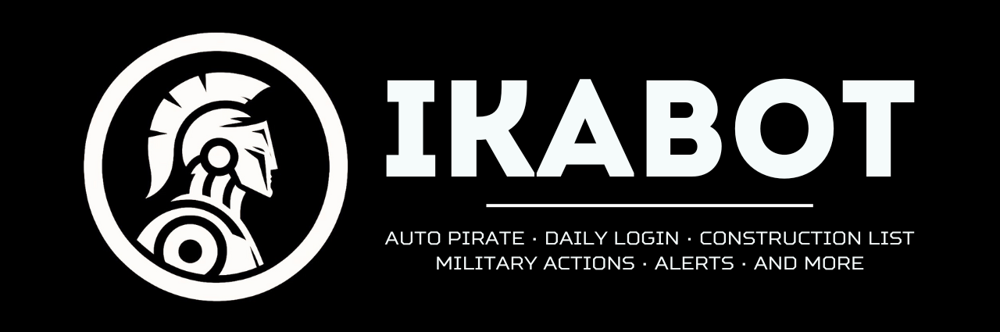
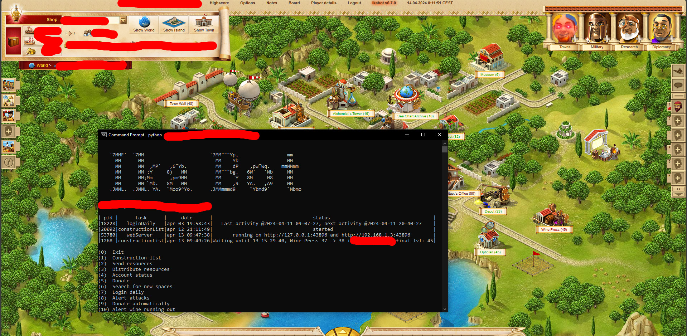

  

Ikabot is a cross-platform Python program that enhances your Ikariam game by offering premium features for free, focusing on city management, warfare strategies, and streamlined alerts.

-[Discover the features](https://github.com/Ikabot-Collective/ikabot/wiki/Features)- 

## Getting Started
- Checkout the [Getting Started guide](https://github.com/Ikabot-Collective/ikabot/wiki/Getting-Started)

## Contribution Guidelines

- Before contributing code, read the [Contribution Guidelines](.github/CONTRIBUTING.md)
  - GitHub issues are for bugs and feature requests.
  - For questions, help and chat in general, join our Discord Server:

     

  
- Want to say thanks?
  - Hit the :star: Star :star: button

## Contributors

This project exists thanks to all the people who contribute.

## Screenshots

